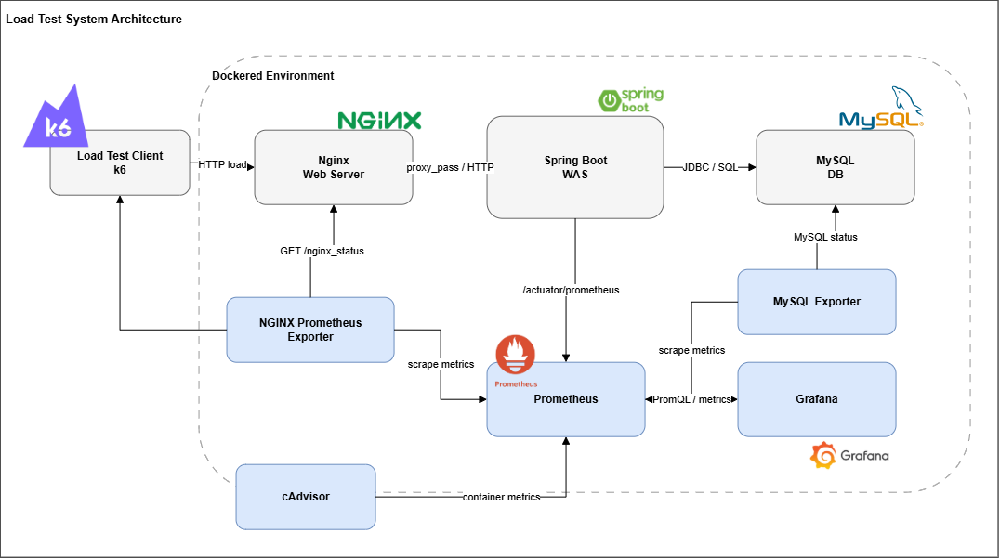
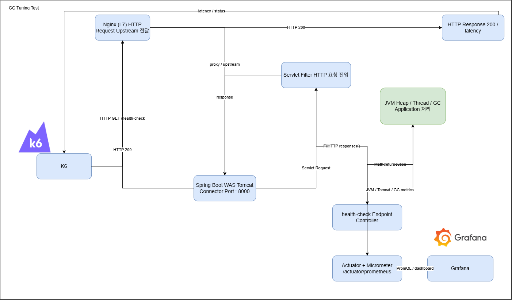
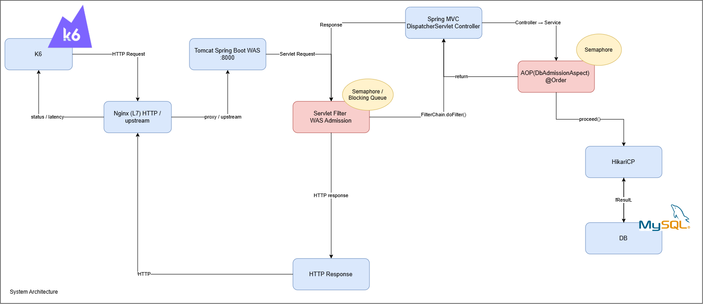

**자세한 내용은 벨로그를 통해 자세히 기술 :**
- [부하 분산 : Redis 시리즈 #1](https://velog.io/@gyrbs22/%EB%B0%B1%EC%97%94%EB%93%9C-Redis%EC%97%90-%EB%8C%80%ED%95%9C-%EA%B3%A0%EC%B0%B0Redis%EC%97%90%EC%84%9C-%EB%B0%9C%EC%83%9D%EA%B0%80%EB%8A%A5%ED%95%9C-%EB%8B%A4%EC%96%91%ED%95%9C-%EC%8B%A4%EB%AC%B4%EC%A0%81-%EC%83%81%ED%99%A9%EA%B3%BC-%EC%9D%B4%EC%97%90-%EB%8C%80%ED%95%9C-Trouble-Shootings-3-TDD%EA%B8%B0%EB%B0%98%EC%9D%98-Redis-Patterns-trouble-Shootings-1)
- [부하 분산 : Reids 시리즈 #2](https://velog.io/@gyrbs22/%EB%B0%B1%EC%97%94%EB%93%9C-Redis%EC%97%90-%EB%8C%80%ED%95%9C-%EA%B3%A0%EC%B0%B0Redis%EC%97%90%EC%84%9C-%EB%B0%9C%EC%83%9D%EA%B0%80%EB%8A%A5%ED%95%9C-%EB%8B%A4%EC%96%91%ED%95%9C-%EC%8B%A4%EB%AC%B4%EC%A0%81-%EC%83%81%ED%99%A9%EA%B3%BC-%EC%9D%B4%EC%97%90-%EB%8C%80%ED%95%9C-Trouble-Shootings-4-TDD%EA%B8%B0%EB%B0%98%EC%9D%98-Redis-Patterns-trouble-Shootings-2)
- [부하 분산 : Caffeine 캐싱/MySQL binlog와 Debezium을 활용한 캐싱 동기화/JVM 장애 복구](https://github.com/LEEHyokyun/spring-boot-bottleneck-points-and-binlog-and-caffeine)
- [부하 조절 : Circuit Breaker/Semaphore Bulkhead](https://velog.io/@gyrbs22/%EB%B0%B1%EC%97%94%EB%93%9C-%EB%B6%84%EC%82%B0-%ED%8A%B8%EB%9E%9C%EC%9E%AD%EC%85%98-Trouble-ShootingCircuit-Breaker-%EB%B0%8F-MSA-%EC%84%9C%EB%B2%84-%EB%B3%84-%EB%B6%84%EC%82%B0%EC%B6%94%EC%A0%81%EB%AA%A8%EB%8B%88%ED%84%B0%EB%A7%81-%ED%99%98%EA%B2%BD-%EA%B5%AC%EC%84%B1-%EB%B0%A9%EC%95%88)
- [부하 조절 : 인프라 구축없이 Servlet Filter/JVM Blocking Queue/Semaphore 만으로 Saturation 2배 개선](https://velog.io/@gyrbs22/%EB%B0%B1%EC%97%94%EB%93%9C-%EC%8B%9C%EC%8A%A4%ED%85%9C%EA%B3%BC-%EA%B0%80%EC%9E%A5-%EC%89%BD%EA%B3%A0-%EA%B0%95%EB%A0%A5%ED%95%98%EA%B2%8C-%EC%83%81%ED%98%B8%EC%9E%91%EC%9A%A9-%ED%95%A0-%EC%88%98-%EC%9E%88%EB%8A%94-%EB%B0%A9%EB%B2%95-4-Series3-%EB%B6%80%ED%95%98%EC%A1%B0%EC%A0%88%EA%B3%BC-%EC%8B%9C%EC%8A%A4%ED%85%9C-Admission-ControllerInner-Semaphore)
- [GC튜닝 및 GC Pause Time 개선/WAS latency와의 상관관계 시리즈 #1](https://velog.io/@gyrbs22/%EB%B0%B1%EC%97%94%EB%93%9C-%EC%8B%9C%EC%8A%A4%ED%85%9C%EA%B3%BC-%EA%B0%80%EC%9E%A5-%EC%89%BD%EA%B3%A0-%EA%B0%95%EB%A0%A5%ED%95%98%EA%B2%8C-%EC%83%81%ED%98%B8%EC%9E%91%EC%9A%A9-%ED%95%A0-%EC%88%98-%EC%9E%88%EB%8A%94-%EB%B0%A9%EB%B2%95-2-%EB%AA%A8%EB%8B%88%ED%84%B0%EB%A7%81-%EA%B7%B8%EB%A6%AC%EA%B3%A0-%EB%B3%91%EB%AA%A9%ED%95%B4%EC%86%8C%EC%9D%98-%EA%B4%80%EC%A0%901000-RPS-%ED%99%98%EA%B2%BD%EC%9D%84-%EA%B5%AC%ED%98%84%ED%95%98%EC%97%AC-DBWAS-level%EC%97%90%EC%84%9C-%EA%B0%81-%EC%A7%80%EC%A0%90%EB%B3%84-%EC%A0%81%EC%9A%A9%ED%95%9C-%EA%B0%9C%EC%84%A0-%EB%B0%A9%EC%95%88%EA%B0%9C%EC%84%A0%EB%A5%A0-%EB%B9%84%EA%B5%90-Series1%ED%8C%8C%EC%9D%B4%ED%94%84%EB%9D%BC%EC%9D%B8-%EA%B5%AC%EC%B6%95)
- [GC튜닝 및 GC Pause Time 개선/WAS latency와의 상관관계 시리즈 #2](https://velog.io/@gyrbs22/%EB%B0%B1%EC%97%94%EB%93%9C-%EC%8B%9C%EC%8A%A4%ED%85%9C%EA%B3%BC-%EA%B0%80%EC%9E%A5-%EC%89%BD%EA%B3%A0-%EA%B0%95%EB%A0%A5%ED%95%98%EA%B2%8C-%EC%83%81%ED%98%B8%EC%9E%91%EC%9A%A9-%ED%95%A0-%EC%88%98-%EC%9E%88%EB%8A%94-%EB%B0%A9%EB%B2%95-3-%EC%84%B1%EB%8A%A5-%EA%B0%9C%EC%84%A0-%EB%AA%A8%EB%8B%88%ED%84%B0%EB%A7%81Saturation%EC%9D%B4-%EB%B0%9C%EC%83%9D%ED%95%98%EC%98%80%EC%9D%84%EB%95%8C-DBWAS-%EA%B3%84%EC%B8%B5%EB%B3%84-%EC%A0%81%EC%9A%A9%ED%95%9C-%EA%B0%9C%EC%84%A0-%EB%B0%A9%EC%95%88%EA%B0%9C%EC%84%A0%EB%A5%A0-%EB%B9%84%EA%B5%90-Series2%EA%B0%9C%EC%84%A0%EC%A0%90-%EC%A0%81%EC%9A%A9%EA%B3%BC-%EA%B0%9C%EC%84%A0%EB%A5%A0-%EB%B9%84%EA%B5%90)

## 1. 개요

> 모니터링은 숫자가 아니라 해석이다.

시스템의 병목은 단순히 모니터링 수치의 "특이한" 부분을 판단하는 것이 아니다.<br/>

- 다양한 네트워크, 처리 계층을 분리한다. 
- 각 계층에 할당된 자원의 상태를 이해한다. 
  - 그에 대한 한계를 넘었는가
  - 대기 시간이 지연되는가
  - 대기 시간이 지연된다면 어느 지점에서 얼마만큼 지연이 되는가 

**결국 모니터링은 수치를 보는 것이 아니라, 시스템을 이해하고 수치를 해석하는 것이다.**

수치 개선이 되었더라도, 시스템을 이해하지 못한 상태에서 적용한 해결책은 적용하지 아니한 것만 못하다.

## 2. 메트릭 수집 파이프라인



- Actuator를 통해 WAS의 메트릭을 prometheus에게 노출한다.
- mysqld_exporter를 통해 DB의 메트릭을 prometheus에게 노출한다.
- 최종적으로 prometheus가 이 메트릭을 수집한다.

```scss
                    [ Pipeline ]
k6 ──────────────► Spring Boot ──────────────► MySQL
                       │                         ▲
                       │                         │
                       │                         │ MySQL 조회
                       ▼                         │
                /actuator/prometheus       mysqld_exporter
                       │                         │
                       └──────────┐    ┌─────────┘
                                  ▼    ▼
                                Prometheus
                                   │
                                   ▼
                                Grafana
```

이때, Prometheus가 수집하는 메트릭의 목적에 따라 엔드포인트 계층별 세부 구조 정립이 필요하다.

```scss
                         [ Load Test Pipeline ]
┌─────────────┐          ┌──────────────────┐
│     k6      │─────────►│    L7 Gateway    │
│             │          │     Nginx        │
└─────────────┘          └────────┬─────────┘
                                  │
                                  │ HTTP
                                  ▼
                                  ┌──────────────────┐
                                  │   Spring Boot    │
                                  │       WAS        │
                                  └────────┬─────────┘
                                           │
                                           │ JDBC
                                           ▼
                                          ┌──────────────────┐
                                          │      MySQL       │
                                          └──────────────────┘
```

위와 같이 load test 파이프라인을 구축하여 다양한 계층에서 병목 원인을 파악하고 개선점을 적용한다.<br/>
(*Local test 환경을 도커 기반으로 진행하므로, Nginx 및 MySQL의 경우 Exporter가 Container를 거쳐 Grafana까지 도달하는 체계를 별도 구축해야 한다.)

```scss
─────── [ 메트릭 수집 경로 ] ───────

    ┌─────────────────┐
    │   Prometheus    │
    │                 │
    │  Time Series    │
    └───────┬─────────┘
            │
            PromQL Query  
            │
            ▼
    ┌─────────────────┐
    │     Grafana     │
    │   Dashboard     │
    └─────────────────┘

           ▲                  ▲                ▲
           │                  │                │
           │scrape            │ scrape         │ scrape
           │                  │                │
    ┌──────┴──────┐   ┌───────┴───────┐   ┌────┴─────────────┐
    │ L7 Exporter │   │ Spring Boot   │   │ mysqld_exporter  │
    │             │   │ /actuator/    │   │                  │
    │ Nginx       │   │ prometheus    │   │ MySQL metrics    │
    └─────────────┘   └───────────────┘   └──────────────────┘
```

이를 기반으로 각 메트릭 수집 계층 지정의 목적과 역할에 대해 아래와 같이 정리한다.

| 계층             | 수집 방식                   | 핵심 지표                                                        | 목적              |
| -------------- | ----------------------- | ------------------------------------------------------------ | --------------- |
| **k6**         | Prometheus Remote Write | TPS, p50, p95, p99, Error                                    | 부하/최종 응답 성능     |
| **L7**         | Nginx Exporter 등        | Request Rate, Active Conn, Status, Latency, Upstream Latency | HTTP Gateway 구간 |
| **WAS**        | Actuator + Micrometer   | CPU, JVM, GC, Tomcat, Hikari                                 | 애플리케이션 병목       |
| **DB**         | mysqld_exporter         | CPU, Connection, Threads, Query/sec, Slow Query              | DB 병목           |
| **Prometheus** | 각 endpoint scrape       | 모든 metric 저장                                                 | 중앙 metric 저장소   |
| **Grafana**    | PromQL                  | 전체 지표 시각화                                                    | 계층별/시간별 상관관계 분석 |

모니터링 체계를 구축하기 위한 파이프라인을 명확하게 이해하고 설계하도록 한다.

## 2-1. Nginx : HTTP를 이해할 수 있는 가장 최전선, 정적 Latency와 WAS Latency의 경계

| 메트릭                    | 의미                   | 성능 분석에서 알 수 있는 것      |
| ---------------------- | -------------------- | --------------------- |
| Request Rate           | 초당 HTTP 요청 수         | 실제 Gateway 유입량        |
| Active Connections     | 현재 활성 연결             | 동시 접속 규모              |
| Response Status        | 2xx/4xx/5xx          | 오류 발생 여부              |
| Request Latency        | Gateway에서 본 요청 처리 시간 | 외부에서 체감하는 HTTP 처리시간   |
| Upstream Latency       | Gateway → WAS 처리 시간  | WAS가 요청을 처리하는 데 걸린 시간 |
| Upstream Connection    | WAS 연결 상태            | Gateway ↔ WAS 연결 상황   |
| Request/Response Bytes | 송수신 데이터량             | 네트워크/Bandwidth 영향     |
| Connection Errors      | 연결 실패                | WAS 접근/네트워크 문제        |

gateway(L7)에서의 latency와 UpStream Latency의 차이를 통해 HTTP Request의 처리 지연 지점을 좁힐 수 있다.

## 2-2. WAS : JVM 및 Tomcat(Thread)의 자원 사용량과 Server Latency

| 메트릭                   | 의미                     | 성능 분석                 |
| --------------------- | ---------------------- | --------------------- |
| CPU                   | WAS 프로세스/서버 CPU 사용량    | CPU 병목 여부             |
| JVM Memory            | Heap/Non-heap 사용량      | 메모리 부족 여부             |
| GC                    | GC 횟수/시간               | GC에 의한 latency 증가 여부  |
| Tomcat Active Threads | 현재 작업 중인 요청 처리 thread  | WAS thread pool 포화 여부 |
| Tomcat Max Threads    | 최대 thread 수            | Thread Pool capacity  |
| Hikari Active         | DB connection 사용 중인 개수 | DB connection 사용량     |
| Hikari Idle           | 유휴 connection          | Pool 여유               |
| Hikari Pending        | connection을 기다리는 요청    | **DB 병목의 핵심 신호**      |
| HTTP Request Count    | WAS가 받은 요청 수           | Gateway와 비교           |
| HTTP Response Time    | WAS 내부 HTTP 처리시간       | 애플리케이션 latency        |
| HTTP 4xx/5xx          | WAS 오류                 | 애플리케이션 장애/과부하         |

JVM Memory부터 Tomcat Thread, HTTP Request에 대한 Server Latency를 직접적으로 모니터링하고 개선점을 도출할 수 있다.

## 2-3. DB(MySQL_Exporter) : 별도 메트릭 수집을 통한 전체 DB Workload 및 개별적인 Query Latency

| 메트릭               | 의미                | 성능 분석             |
| ----------------- | ----------------- |-------------------|
| CPU               | MySQL 서버 CPU      | DB CPU 병목         |
| Connections       | 현재 연결 수           | DB connection 사용량 |
| Threads Connected | 연결된 client thread | Connection 규모     |
| Threads Running   | 현재 실행 중인 thread   | 실제 DB 작업량         |
| Queries           | 누적 query 수        | Query 처리량 계산      |
| Queries/sec       | 초당 query 처리량      | **DB RPS**        |
| Slow Queries      | 느린 query 수        | SQL 성능 문제         |
| InnoDB Row Lock   | row lock 관련 지표    | Lock 병목           |
| Buffer Pool       | InnoDB cache 사용   | 메모리/cache 상태      |
| Disk I/O          | 디스크 작업량           | I/O 병목            |
| Transactions      | transaction 처리량   | DB workload       |

WAS와 DB에서의 트랜잭션 처리량 및 이로 인한 Connection 점유율 및 실행 Query 수를 측정할 수 있다.<br/>
개별적인 Query 실행에 대한 세부 계획은 Query Explain 및 Index 구조 통해 확인하여, 특정 Query에 대한 성능 개선점을 도출할 수 있다.

## 3. Normal 상태를 표준적 자원 상태에 기반하여 Abnormally/Subnormally 정립

테스트를 진행하기 앞서, 시스템의 임계치를 확인하기 위해 Stress test 시나리오를 구성한다.

```scss
k6
│
▼
L7
Request: 500 ~ 600 req/s
Upstream latency: 50ms
│
▼
WAS
Tomcat: 50/200
Hikari: 10/10
Pending: 0
│
▼
DB
CPU: 30%
Threads Running: 8
```

현재 시스템의 기본 인프라인 Tomcat Thread(200개), Hikari Pool(10)의 상태에서 부하를 늘려가며 Saturation 지점을 먼저 확인한다.

## 3-1. Abnormally

각 계층에서 병목 원인 신호를 파악하였다 하더라도,<br/>
그것이 하위 계층에서 수반하는 Waterfall인지, 해당 계층에서 발생한 특정 원인으로 인한 병목인지 파악해야 한다. 

> 만약 WAS에서 병목이 발생하였다면

WAS의 병목은 결국 Server의 처리가 늦어진다는 의미이며,<br/>
Tomcat Thread 및 Hikari Pool 점유율이 높아지고 DB Connection을 위한 Pending이 그만큼 이전에 비해 Active해진다.

```scss
k6
│
▼
L7
p99 ↑
Upstream latency ↑
│
▼
WAS
Tomcat Active ↑
Hikari Active → 10/10
Hikari Pending ↑
│
▼
DB
CPU ↑
Threads Running ↑
Query latency ↑
```

- KeyPoints : 
  - UpStream Latency
  - Tomcat / Hikari Pool Activity

> 만약 DB에서 병목이 발생한다면

DB의 병목은 Nginx(L7) 및 WAS 계층에서의 수치를 악화시킬 수 있다.<br/>
이때, WAS 병목과 달리 DB Exporter를 통해 감지한 CPU 및 자원 사용량을 확인하여 병목 원인을 특정할 수 있다.

```scss
k6 Traffics
      │
      ▼
      L7
      p99 ↑
      Upstream latency ↑
      │
      ▼
      WAS
      Tomcat Active ↑
      Hikari Active → 10/10
      Hikari Pending ↑
      │
      ▼
      DB
      CPU ↑
      Threads Running ↑
      Query latency ↑
```

## 3-2. Subnormally(*수치 지표 개선의 함정) : 수치가 좋아졌다는 것이 "개선"의 의미는 아니다.

> WAS의 병목으로 인해 DB의 Activity를 오히려 감소한 경우

WAS의 포화로 인해 DB 계층까지 처리가 이어지지 않아 DB의 모니터링 지표가 수치적으로는 좋아질 수 있다.

```scss
k6
│
▼
L7
Upstream latency ↑
│
▼
WAS
CPU = 100%
Tomcat = 200/200
Hikari Pending = 0
│
▼
DB
CPU = 20%
Queries/sec ↓
```

하지만, Activity의 감소를 의미하는 것일뿐 병목 개선을 의미하지는 않는다.

## 4. GC 튜닝에 따른 GC pause time 개선률 비교 및 WAS latency와의 상관관계



### 4-1. GC 튜닝별 GC Pause time 및 Overhead 비교

| 구분 | 주요 설정/변경 | Saturation | Avg GC Pause | Total GC Pause | GC Overhead |
|---|---|---:|---:|---:|---:|
| Baseline | 기본 설정 | 약 450~460 RPS | 약 30ms | 239ms | 0.16% |
| ParallelGCThreads 증가 | Parallel GC Thread 증가 | 약 380~400 RPS | - | 81.8ms | - |
| MaxGCPauseMillis=100 | G1 Pause Target 조정 | 약 330~360 RPS | 45.8ms | 320ms | 0.17% |
| G1GC Composite | ConcGCThreads=1, Adaptive IHOP Off, IHOP=30, MaxGCPauseMillis=200 | 약 450~490 RPS | 약 15ms | 81.8ms | 0.17% |
| ZGC Composite | ZGC 적용 | 약 390~410 RPS | 약 0.4~0.6ms | 3.27ms | 1.86% |

### 4-2. GC 튜닝에 따른 성능 변화 및 WAS latency와의 관계 분석

- G1GC Composite는 GC Pause를 크게 낮췄지만 WAS의 포화 임계치 자체는 Baseline과 큰 차이가 없었다.
- ZGC는 GC Pause를 극적으로 감소시켰지만 CPU/동시성 비용 등의 영향으로 WAS 임계치는 오히려 낮아졌다.
- 따라서 **GC Pause Time 감소 = WAS Saturation 개선**으로 직접 연결된다고 볼 수 없었으며, 실제 병목은 WAS Thread, DB/HikariCP 등 전체 처리 경로를 함께 확인해야 했다.

## 5. WAS 및 WAS/DB에 적용한 Semaphore 및 Blocking Queue 기반 부하 조절과 이에 따른 성능 개선 효과



## 5-1. WAS Admission Filter / Blocking Queue 단독 적용 및 개선 효과 확인

`Semaphore.acquire()`처럼 Tomcat Thread 자체를 blocking시키는 방식이 아니라, 처리 슬롯을 얻지 못한 요청은 `AsyncContext`로 전환하고 Queue Worker에게 제어권을 넘겼다.

```text
                    Request
                       │
                       ▼
              Servlet Filter
                       │
              tryAcquire()
                 /         \
               성공         실패
                │             │
                ▼             ▼
             WAS 처리       AsyncContext
                              │
                              ▼
                       BlockingQueue
                              │
                              ▼
                       Worker Thread
                              │
                     Semaphore 확보
                              │
                              ▼
                       Async Dispatch
                              │
                              ▼
                         WAS 처리
```

핵심은 WAS에서의 동시처리량을 조절하여 임계지점을 향상할 수 있는가.

- 주요 구현 요소

| 방안 | 목적 | 확인 사항 | 결과 |
|---|---|---|---|
| `Semaphore.acquire()` | 동시 처리량 제한 | Tomcat Thread blocking 여부 | WAS Thread 점유 증가 가능성이 있어 최종 방식으로 채택하지 않음 |
| `Semaphore.tryAcquire()` | 처리 가능 요청만 즉시 실행 | permit 확보/실패 비율 | 빠른 부하에서 동시 처리량 제어 가능 |
| `BlockingQueue` | 초과 요청 대기 | Queue size / 적재 여부 | 충분히 빠른 WAS 환경에서는 Queue가 거의 형성되지 않음 |
| `AsyncContext` | Tomcat Thread와 Queue 대기 책임 분리 | Tomcat Thread 점유 / Worker 처리 | Queue 대기 요청을 비동기화하는 핵심 수단 |
| `WAS Queue Worker` | Queue 요청을 별도 처리 | Worker 수 / dispatch | 12개 Worker로 비동기 처리 |
| Load Shedding | Queue까지 포화된 요청 제거 | 503 / 실패 요청 | 시스템 보호를 위한 최종 방어선 |

- 적용 결과

| 지표 | 기존 시스템 | WAS Semaphore/Queue 적용 | 해석 |
|---|---:|---:|---|
| WAS Saturation | 약 480~500 RPS | 큰 변화 없음 | WAS 자체 임계치 개선 효과 제한적 |
| P95 | 약 20ms | 약 20~30ms | 유의미한 개선 없음 |
| P99 | 약 30ms | 약 20~30ms | 유의미한 개선 없음 |
| WAS Semaphore | - | 최대 450 | 빠르게 사용됨 |
| WAS Queue | - | 거의 발생하지 않음 | WAS가 Queue 대기까지 갈 정도로 느리지 않음 |
| Tomcat Thread | 기존 처리 | 바쁘게 동작 | 실제 처리 자체가 빠르게 이루어짐 |
| 핵심 결과 | WAS 자체 처리 | 부하 제어 | **처리량 개선보다는 불필요한 제어가 추가될 가능성 확인** |

따라서 **빠르게 처리되는 계층에서는 무조건 Queue를 만드는 것이 아니라 실제 병목이 발생하는 계층의 동시성을 제어하는 것이 중요하다.**

## 5-2. WAS/DB Semaphore 추가 적용을 통한 부하 조절 효과 확인

WAS에서는 요청 자체가 Servlet 계층에 도달한 상태이므로 `AsyncContext`를 이용해 요청의 제어권을 Worker에게 넘길 수 있었다.<br/>
하지만 DB 계층에서는 이미 Worker Thread에 처리 책임 분리, Tomcat Thread의 동기식 처리로 인한 latency 증가 등을 고려하여 Semaphore 단독 적용.

```text
Traffic ↑
   │
   ▼
WAS Admission
   │
   ▼
DB Semaphore = 20
   │
   ├── permit 확보 → HikariCP
   │
   └── permit 실패 → Load Shedding
                       │
                       ▼
                 HikariCP 경쟁 억제
                       │
                       ▼
                 Pending 폭증 억제
```

DB에 도달하기 위해 동시처리요청에 대한 조절 및 이로 인한 Pending Connection / HikariCP latency 감소 효과를 파악하는 것이 핵심.

- 주요 설정

| 구성 | 설정 |
|---|---:|
| WAS Semaphore | **150** |
| WAS Queue | **800** |
| WAS Queue Worker | **12** |
| DB Semaphore | **20** |
| DB Queue | 없음 |
| DB Admission | **AOP** |
| DB Queue Worker | 없음 |
| Tomcat Thread | **200 (default 유지)** |
| HikariCP | **10 (default 유지)** |

- 적용 결과

| 지표 | ① 기존 시스템 | ② WAS Filter | ③ WAS Filter + DB Semaphore |          개선 효과 |
|---|---:|---:|---:|---------------:|
| **DB/WAS Saturation 시작점** | 120~123 RPS | 변화 없음 | **220~230 RPS** |       **약 2배** |
| **P95 Latency** | **1,663ms** | 약 20~30ms 수준* | **193ms** | **약 89.4% 감소** |
| **P99 Latency** | 최대 약 **15~20초** | 약 20~30ms 수준* | 급격한 상승 억제 | **약 96.7% 감소** |
| **HikariCP Pending** | 최대 **189** | Queue 발생 없음 | **폭증 억제** |        **안정화** |
| **HikariCP Pool** | 10 | 10 | 10 |          변경 없음 |
| **HikariCP Latency** | 약 676ms 이후 불안정 | - | 약 676ms 수준에서 안정 |     **변동성 감소** |
| **처리 성공률** | 임계치 초과 시 급격히 악화 | - | 약 **60~70%** |       초과 부하 제어 |
| **JVM Heap** | 약 6~7% | 약 9~10% | 약 6~7% |       추가 부담 미미 |
| **핵심 효과** | HikariCP 경쟁으로 병목 | WAS 보호만으로 한계 | **DB 접근 동시성 제어** |     **가장 효과적** |

## 5-3. 결론

```scss
Request
   │
   ▼
┌─────────────────────────────────────────────┐
│ WAS Admission                              │
│                                             │
│  Semaphore 150                             │
│       │                                     │
│       ├── 성공 ────────────────┐            │
│       │                        │            │
│       └── 실패 → Queue 800     │            │
│                    │           │            │
│                 Worker 12      │            │
│                    │           │            │
│              Semaphore 확보 ──┘            │
└────────────────────┬────────────────────────┘
                     │
                     ▼
                Spring MVC
                     │
                     ▼
┌─────────────────────────────────────────────┐
│ DB Admission                                │
│                                             │
│  DB Semaphore 20                            │
│       │                                     │
│       ├── 성공 ────────────────┐            │
│       │                        │            │
│       └── 실패 → Load Shedding │            │
└────────────────────┬───────────┘            │
                     │                        │
                     ▼                        │
                HikariCP 10                   │
                     │                        │
               Connection 획득                │
                     │                        │
                     ▼                        │
                   MySQL                      │
                     │                        │
                     ▼                        │
               Connection 반납                │
                     │                        │
                     ▼                        │
              DB Semaphore 해제              │
                                              │
                     ◄────────────────────────┘
                     │
                     ▼
              HTTP Response
                     │
                     ▼
             WAS Semaphore 해제
```

> 별도의 Redis/Kafka 등의 인프라를 추가하지 않고도,
> - DB/WAS Saturation 시작점: **120 - 123 → 220 - 230 RPS**
> - 약 **2배 수준의 임계치 향상**
> - P95: **1,663ms → 193ms**
> - 약 **89.4% latency 감소**
> - HikariCP Pending 최대 **189 → 폭증 억제**
> - HikariCP Pool **10개 유지**

## 참고. Docker Container로 구성된 환경에 대한 자원 사용 지표(Saturation)

자원 허용량에 근접하면 처리 지연이 발생하고, 자원 포화도는 그만큼 증가한다(Saturation).<br/>
따라서, 각 컨테이너가 CPU/Memory/Network/Disk 등의 자원을 얼마나 사용하고 있는지 cAdvisor를 통해 확인한다.

## Additional

테스트 데이터 삽입을 위해 Batch+Instancio를 활용하고, 이에 대한 테스트 코드는 Job 통합테스트 로직으로 작성한다.